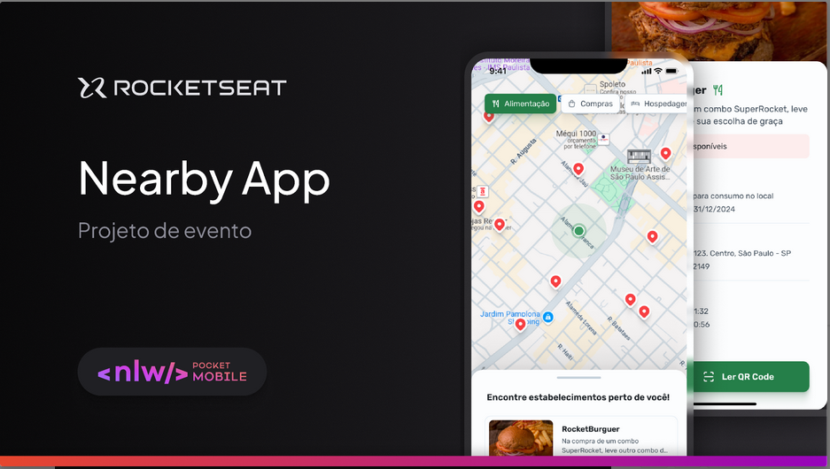

## **Visão Geral**

O Projeto Nearby é um aplicativo desenvolvido em **React Native** utilizando o **Expo**, com foco em exibir informações dinâmicas e interativas, como listas de categorias, locais e validação de cupons.

  
